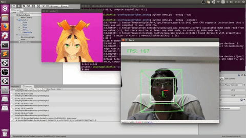
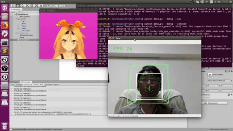

# VTuber_Unity
Use Unity 3D character and Python deep learning algorithms to stream as a VTuber!

This is part of the [OpenVTuberProject](https://github.com/kwea123/OpenVTuberProject), which provides many toolkits for becoming a VTuber.

Youtube Playlist (Chinese) (Covers videos 1-4):

--------------------------------------------------------------------------------
# Credits
First of all, I'd like to give credits to the following projects that I borrow code from:

| Project | LICENSE |
|:---:|----|
| [head-pose-estimation](https://github.com/yinguobing/head-pose-estimation) | [LICENSE](licenses/LICENSE.head-pose-estimation) |
| [face-alignment](https://github.com/1adrianb/face-alignment) | [LICENSE](licenses/LICENSE.face-alignment) |
| [GazeTracking](https://github.com/antoinelame/GazeTracking) | [LICENSE](licenses/LICENSE.GazeTracking) |

And the virtual character [unity-chan](http://unity-chan.com/) © UTJ/UCL.

# Installation

## Hardware
*  OS: Ubuntu 16.04 (18.04 may also work) or Windows 10 64bits or MacOS
*  (Optional but recommended) An NVIDIA GPU (tested with CUDA 9.0, 10.0 and 10.1, but may also work with other versions)

## Software
*  Python3.x (installation via [Anaconda](https://www.anaconda.com/distribution/) is recommended; **mandatory for Windows users**)
   * (Optional) It is recommended to use conda environments. Run `conda create -n vtuber python=3.6`. Activate it by `conda activate vtuber`.
*  Python libraries
   * Ubuntu:
      * Install the requirements by `pip install -r requirements_(cpu or gpu).txt`
      * If you have CUDA 10.1, `pip install onnxruntime-gpu` to get faster inference speed using onnx model.
   * Windows:
      * CPU:
         *  `pip install -r requirements_cpu.txt`
         *  if [dlib](https://github.com/davisking/dlib) cannot be properly installed, follow [here](https://github.com/kwea123/VTuber_Unity/wiki/Dlib-installation-on-Windows).
      * GPU: 
         * Install [pytorch](https://pytorch.org/) using `conda`. Example: `conda install pytorch==1.2.0 torchvision==0.4.0 cudatoolkit=10.0 -c pytorch`
         * Install other dependencies by `pip install -r requirements_gpu.txt`.
         * If you have CUDA 10, `pip install onnxruntime-gpu` to get faster inference speed using onnx model.
           
*  Optional
   * [OBS Studio](https://obsproject.com/) if you want to embed the virtual character into your videos.
   *  Unity Editor if you want to customize the virtual character.
        *  [Linux installation](https://forum.unity.com/threads/unity-on-linux-release-notes-and-known-issues.350256/)
        *  [Windows installation](https://unity3d.com/get-unity/download)
   
# Example usage
Here we assume that you have installed the requirements and activated the virtual environment you are using.

## 0.  Model download
You need to download the models [here](https://github.com/kwea123/VTuber_Unity/releases/tag/v1.0), extract and put into `face_alignment/ckpts`.

If you don't use `onnxruntime`, you can omit this step as the script will automatically download them for you.

## 1.  Face detection test
Run `python demo.py --debug`. (add `--cpu` if you have CPU only)

You should see the following:

  
  
   
  Left: CPU model. Right: GPU model run on a GTX1080Ti.

## 2.  Synchronize with the virtual character
1.  Download and launch the binaries [here](https://github.com/kwea123/VTuber_Unity/releases) depending on your OS to launch the unity window featuring the virtual character (unity-chan here).
**Important: Ensure that only one window is opened at a time!**
2.  After the vitual character shows up, run `python demo.py --connect` to synchronize your face features with the virtual character. (add `--debug` to see your face and `--cpu` if you have CPU only as step 1.)

You should see the following:

  
  
   
  Left: CPU model. Right: GPU model run on a GTX1080Ti.

Enjoy your VTuber life!

# Functionalities details
In this section, I will describe the functionalities implemented and a little about the technology behind.

## Head pose estimation
Using [head-pose-estimation](https://github.com/yinguobing/head-pose-estimation) and [face-alignment](https://github.com/1adrianb/face-alignment), deep learning methods are applied to do the following: face detection and facial landmark detection. A face bounding box and the 68-point facial landmark is detected, then a PnP algorithm is used to obtain the head pose (the rotation of the face). Finally, kalman filters are applied to the pose to make it smoother.

The character's head pose is synchronized.

As for the visualization, the white bounding box is the detected face, on top of which 68 green face landmarks are plotted. The head pose is represented by the green frustum and the axes in front of the nose.

## Gaze estimation
Using [GazeTracking](https://github.com/antoinelame/GazeTracking), The eyes are first extracted using the landmarks enclosing the eyes. Then the eye images are converted to grayscale, and a pixel intensity threshold is applied to detect the iris (the black part of the eye). Finally, the center of the iris is computed as the center of the black area.

The character's gaze is not synchronized. (Since I didn't find a way to move unity-chan's eyes)

As for the visualization, the red crosses indicate the iris.

## Miscellaneous

1.  Estimate [eye aspect ratio](https://www.google.com/search?q=eye+aspect+ratio&rlz=1C1GCEU_jaJP829JP829&oq=eye&aqs=chrome.0.69i59j69i57j69i65j69i61.846j0j7&sourceid=chrome&ie=UTF-8): The eye aspect ratio can be used to detect blinking, but currently I just use auto blinking since this estimation is not so accurate.

2.  Estimate [mouth aspect ratio](https://www.google.com/search?rlz=1C1GCEU_jaJP829JP829&sxsrf=ACYBGNR1ME-HV3c5avZ15yahkkQd1omjpw%3A1571114646809&ei=lk6lXcyIMZ-Rr7wP0OCX8A4&q=mouth+aspect+ratio&oq=mouth+aspect+ratio&gs_l=psy-ab.3..35i39j0i203.30193.31394..31535...0.0..0.109.710.4j3......0....1..gws-wiz.......0i7i30j0i8i30j0i10i30j0i7i10i30j0i8i7i30j0i13j0i13i30j0i13i5i30.IWlXGoyW5GE&ved=0ahUKEwjMq7KTup3lAhWfyIsBHVDwBe4Q4dUDCAs&uact=5): I use this number to synchronize with the character's mouth.

3.  The mouth distance is used to detect smile and synchronize with the character.

# Unity Project
If you want to customize the virtual character, you can find the unity project in [release](https://github.com/kwea123/VTuber_Unity/releases).

# License
[MIT License](LICENSE)
